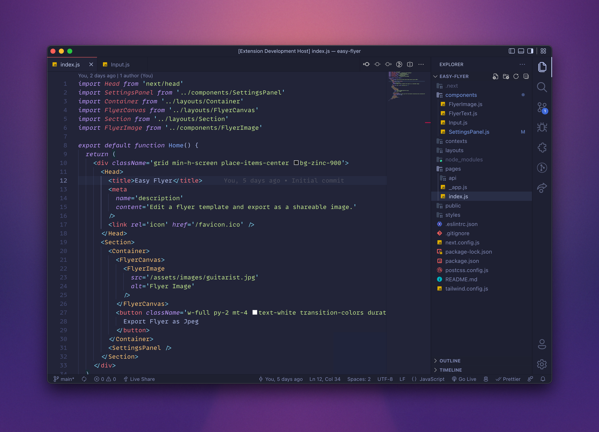
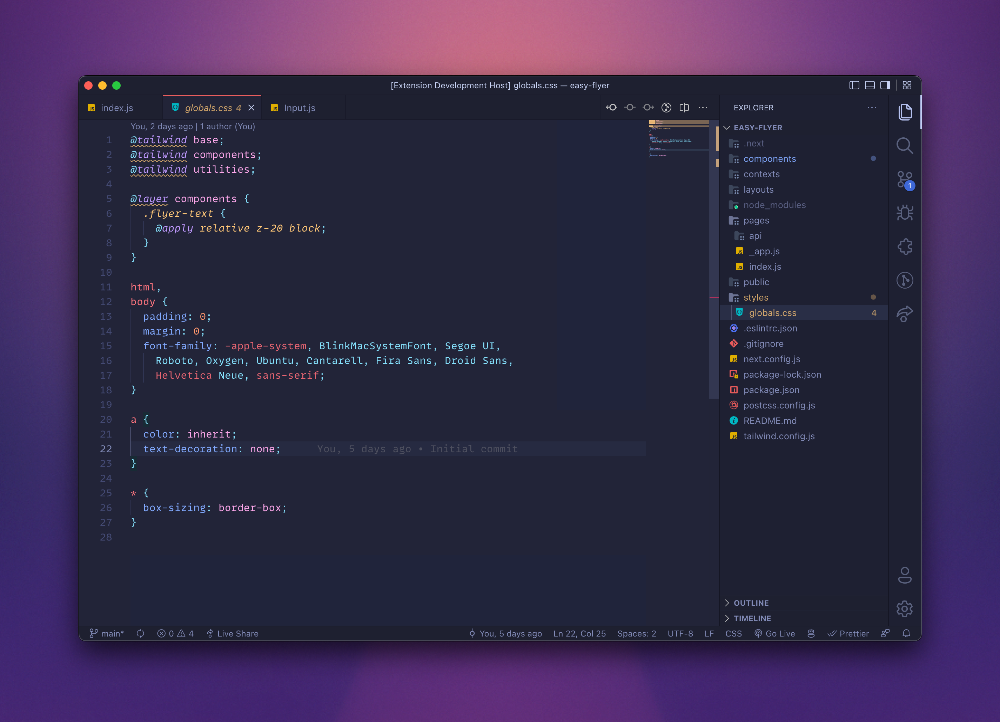
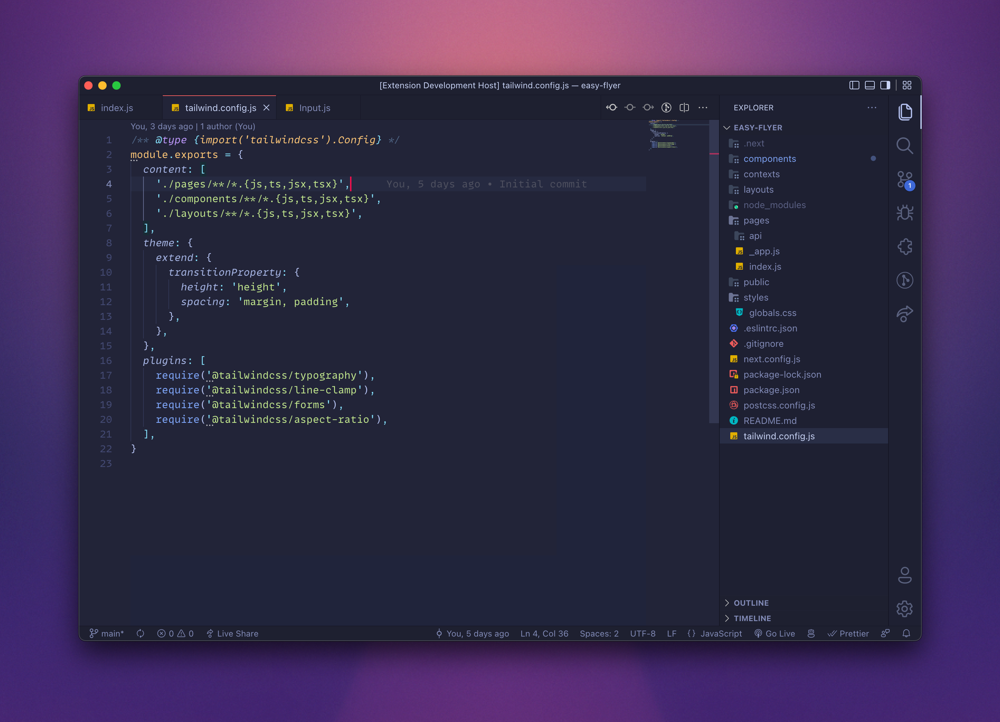

# Electronic Dawn Theme

A slight alteration of the beautiful [Electronic Moonlight](https://marketplace.visualstudio.com/items?itemName=isaaccodes.electronic-moonlight-theme) theme which is based off of [Electron Color Theme](https://marketplace.visualstudio.com/items?itemName=kuscamara.electron) and [Moonlight II Italics](https://marketplace.visualstudio.com/items?itemName=atomiks.moonlight). Features a subtly brighter editor background and a few other minor changes.

## Screenshots






## Installation

1. Open Extensions sidebar panel in VS Code.
2. Search for Electronic Moonlight Theme
3. Click Install to install it.

## Settings

Here are a few settings I use:

```
"editor.fontFamily": "'MonoLisa', 'Fira Code', 'Victor Mono', Menlo, Monaco, 'Courier New', monospace",
"editor.fontSize": 15,
"editor.fontLigatures": true,
```
